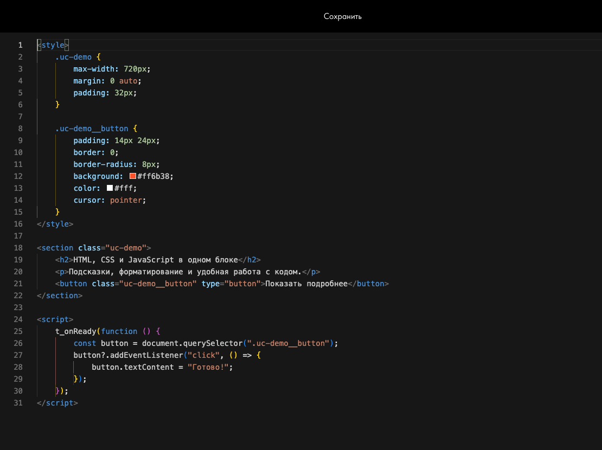
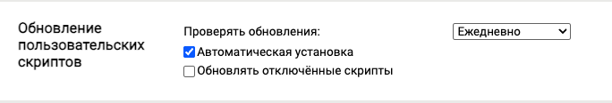
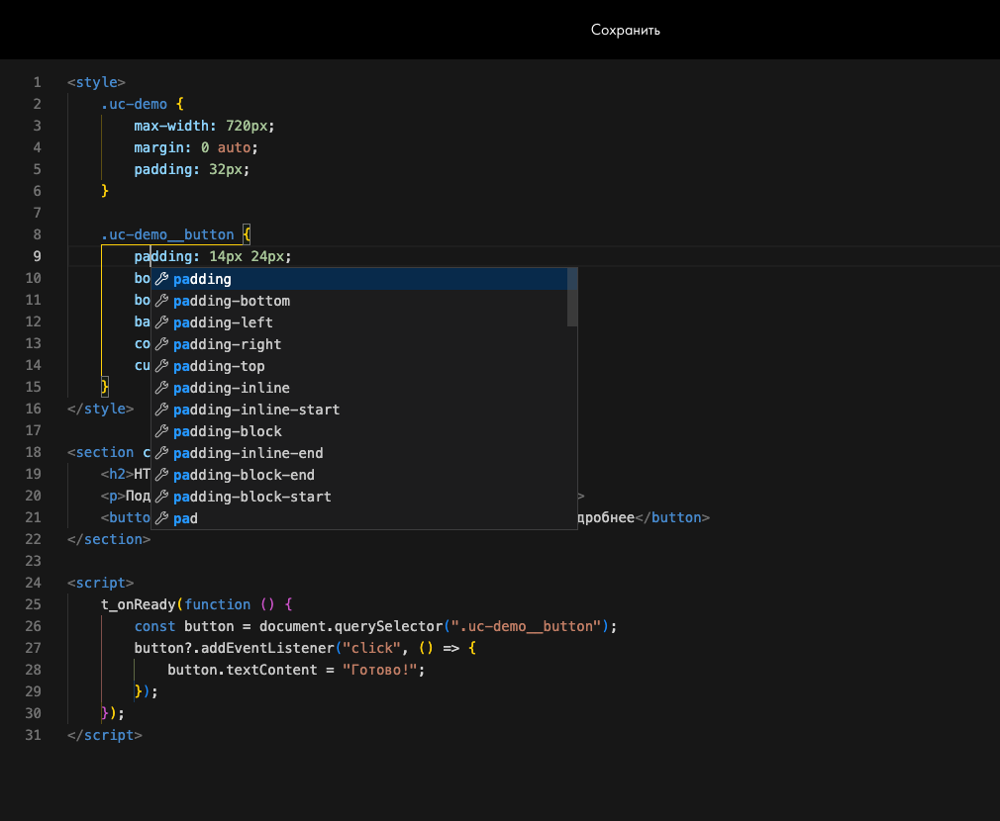
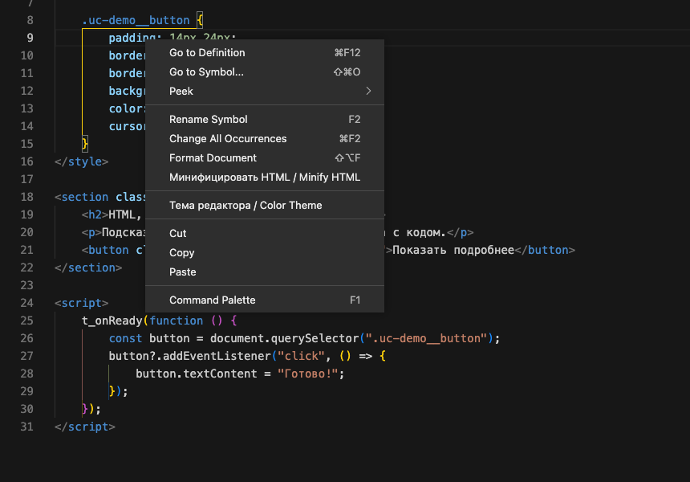
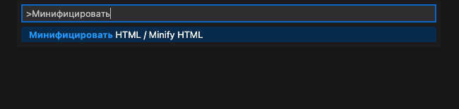
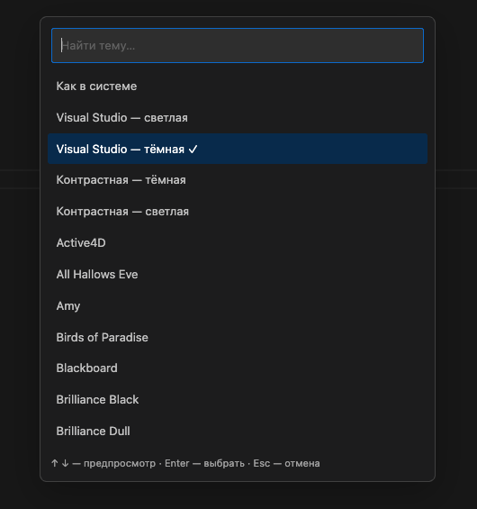
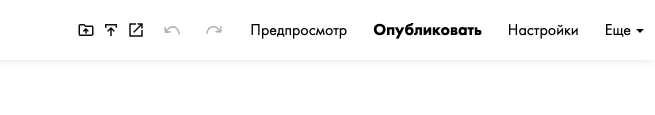
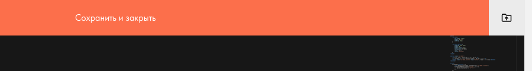
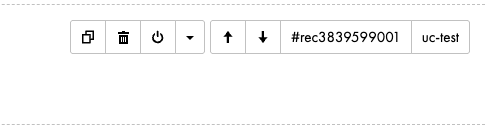

# Тильда + Monaco

Редактор кода Monaco в блоке T123: подсказки для HTML, CSS и JavaScript, форматирование, минификация и темы. Дополнительно — публикация страницы или всего проекта и копирование ID и CSS-класса блока.

Это неофициальный скрипт для **Tampermonkey**, который добавляет функции в редактор Тильды в вашем браузере.

**[Установить скрипт](https://raw.githubusercontent.com/namesakehake/tilda-monaco/main/dist/tilda-monaco.user.js)**

[Установка](#установка) · [Обновление](#обновление) · [Горячие клавиши](#горячие-клавиши) · [Возможности](#возможности) · [Помощь](#помощь)

## Установка

Нужен настольный Chrome или браузер на Chromium, например Helium или Edge.

1. Установите **[Tampermonkey](https://www.tampermonkey.net/)** для своего браузера.
2. Откройте `chrome://extensions` (в Edge — `edge://extensions`) → **Tampermonkey → «Подробнее»** и включите **«Разрешить пользовательские скрипты»**. Если этого переключателя нет, включите **«Режим разработчика»** на странице расширений.
3. Откройте **[ссылку установки](https://raw.githubusercontent.com/namesakehake/tilda-monaco/main/dist/tilda-monaco.user.js)** и нажмите **«Установить»** в окне Tampermonkey.
4. Перезагрузите редактор страницы Тильды и откройте **T123 → «Контент»**. При первом открытии дождитесь загрузки Monaco.

Вместо установки открылся текст файла? [Установите скрипт через поле «Установить с URL»](docs/troubleshooting.md#ссылка-открыла-исходный-код).

## Обновление

В **Tampermonkey → «Панель управления» → «Настройки» → «Обновление пользовательских скриптов»** выберите **«Ежедневно»** и включите **«Автоматическая установка»**.

Новые версии будут приходить с GitHub при очередной проверке. После обновления сохраните открытый блок и перезагрузите Тильду.

## Горячие клавиши

Для сохранения и команд Monaco сначала кликните в код. Сочетания публикации работают и внутри редактора кода, и на странице редактирования Тильды.

| Действие | Windows / Linux | macOS |
| --- | --- | --- |
| Сохранить блок без публикации | `Ctrl + S` | `Cmd + S` |
| Сохранить блок и опубликовать **текущую страницу** | `Ctrl + Shift + S` | `Cmd + Shift + S` |
| Сохранить, опубликовать **текущую страницу** и открыть её | `Ctrl + Alt + Shift + S` | `Cmd + Option + Shift + S` |
| Открыть команды: форматирование, минификация, темы | `F1` | `F1` |
| Отменить изменение кода | `Ctrl + Z` | `Cmd + Z` |
| Увеличить / уменьшить отступ | `Tab` / `Shift + Tab` | `Tab` / `Shift + Tab` |

Если `F1` занята системой, попробуйте `Fn + F1` или контекстное меню редактора. **Весь сайт** публикуется отдельной кнопкой с папкой — [где она находится](#публикация-страницы-и-всего-проекта).

## Возможности

### Подсказки и работа с кодом

Подсказки для HTML и встроенных CSS и JavaScript, сворачивание кода, мини-карта и перенос длинных строк. Окно редактора занимает большую часть экрана.

Сохраняйте код кнопками Тильды или [горячими клавишами](#горячие-клавиши).

### Форматирование и минификация

Нажмите правой кнопкой в коде: **Format Document** отформатирует его через Prettier, а **«Минифицировать HTML»** уменьшит размер. Изменение можно отменить через **Ctrl/Cmd + Z**.

Команды также доступны через **F1** — начните вводить название и нажмите Enter.

### Темы редактора

Правый клик → **«Тема редактора / Color Theme»**. Есть светлые, тёмные, контрастные темы и системный режим. Выбор сохраняется в браузере.

### Публикация страницы и всего проекта

В верхней панели добавляются три кнопки. На скриншоте они первые слева: **опубликовать весь сайт → опубликовать страницу → открыть страницу**. Наведите курсор на иконку, чтобы увидеть подсказку.

У штатных кнопок **«Сохранить»** и **«Сохранить и закрыть»** тоже есть быстрые действия:

- **Shift + клик** — сохранить блок и опубликовать **текущую страницу**.
- **Alt / Option + клик** — сохранить блок, опубликовать **текущую страницу** и открыть её.

В HTML-редакторе кнопка папки рядом с **«Сохранить и закрыть»** сначала сохраняет блок, затем публикует весь текущий проект.

Нажатие запускает публикацию сразу. При публикации проекта страницы в архивных папках пропускаются.

### Копирование ID и CSS-класса

Наведите курсор на блок и нажмите **`#rec…`** или **`uc-…`** справа сверху, рядом со стрелками перемещения. Кнопка класса появляется, когда у блока задан **CSS Class Name**.

## Помощь

- [Подробное руководство](docs/usage.md) — сочетания клавиш, команды, публикация и отключение скрипта.
- [Решение проблем](docs/troubleshooting.md) — установка, обновления и частые ошибки.
- [Для разработчиков](docs/development.md) — локальное подключение, устройство скрипта и выпуск новых версий.

Нашли ошибку? [Создайте Issue](https://github.com/namesakehake/tilda-monaco/issues) с описанием и шагами повторения.

## Лицензия

[MIT](LICENSE). Сторонние компоненты сохраняют свои лицензии — см. [уведомления](THIRD_PARTY_NOTICES).
