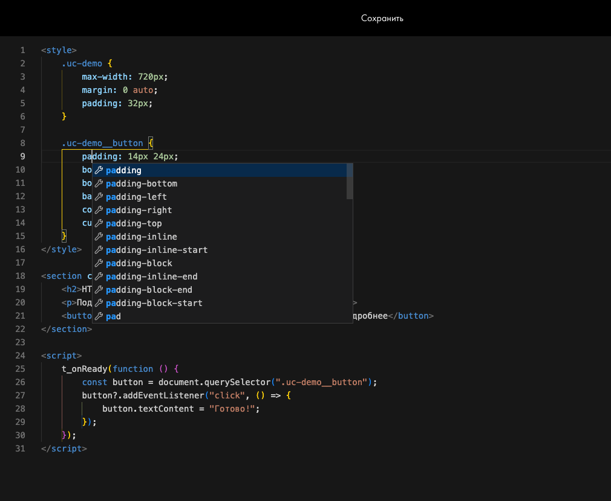
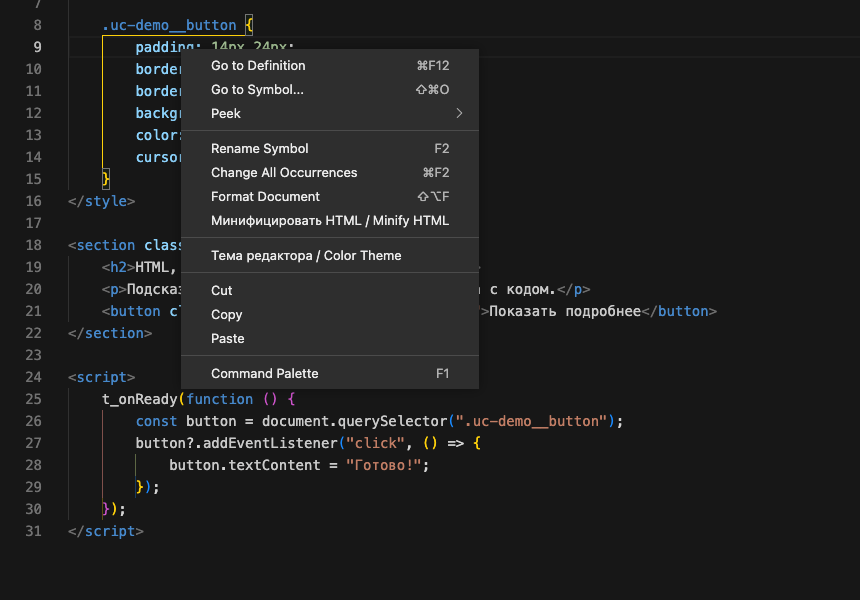
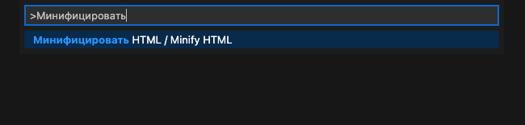
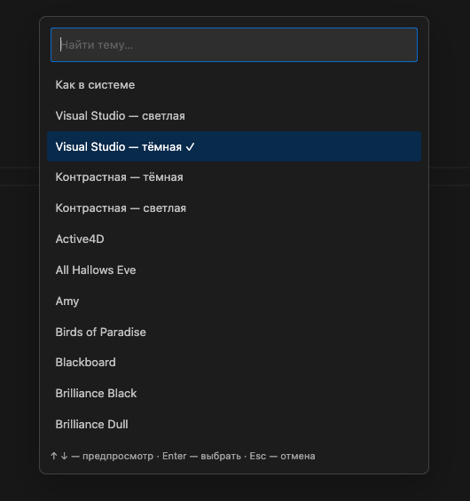
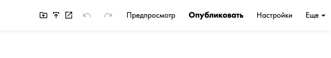
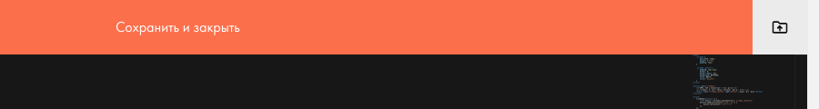
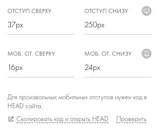
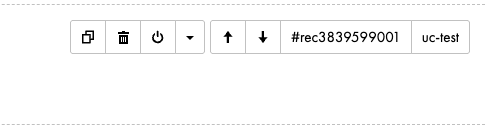

# Подробное руководство

[← Установка и возможности](../README.md) · [Решение проблем](troubleshooting.md) · [Локальная разработка](development.md)

[Редактирование](#редактирование-и-сохранение) · [Форматирование](#форматирование-и-минификация) · [Темы](#темы) · [Публикация](#публикация-и-открытие-страницы) · [Отступы](#произвольные-отступы-блоков) · [ID и класс](#копирование-id-и-класса-блока) · [Обновление](#обновление) · [Отключение](#как-отключить)

## Где работает скрипт

Нужны настольный Chrome или браузер на Chromium, Tampermonkey и доступ к редактированию страницы Тильды. Скрипт запускается на `https://tilda.ru/page/*` и `https://tilda.cc/page/*`. Monaco появляется в HTML-поле блока, например **T123 → «Контент»**.

На опубликованном сайте, внутри отдельного редактора Zero Block (`/zero/`) и в обычных текстовых полях эти дополнения не запускаются. Интернет нужен для работы Тильды, установки, проверки обновлений и загрузки библиотек редактора.

## Редактирование и сохранение

Открывайте HTML-поле блока как обычно. Monaco отображает код, а скрипт синхронизирует изменения со штатным Ace и полем формы, из которых Тильда сохраняет блок.

- `Tab` делает отступ в четыре пробела; `Shift+Tab` уменьшает отступ. Длинные строки переносятся визуально.
- Автоподсказки появляются при вводе; учитываются HTML и встроенные CSS/JavaScript. Это редактор отдельного HTML-блока, без доступа к файлам и зависимостям полноценного проекта. Emmet не подключён.
- Сохраняйте штатными кнопками Тильды. **`Ctrl+S` / `Cmd+S` внутри Monaco** вызывает штатное сохранение блока без публикации.
- Одного ввода текста недостаточно для сохранения на сервере. Перед закрытием или перезагрузкой вкладки сохраните блок.

**F1** открывает палитру команд Monaco: начните вводить имя нужного действия. Если клавиша занята системой, используйте `Fn+F1` или контекстное меню редактора. Для сочетаний клавиш сначала кликните в код, чтобы фокус был внутри Monaco.

*Подсказки работают и внутри `<style>`. На примере Monaco предлагает CSS-свойства при редактировании `padding`.*

## Форматирование и минификация

| Задача | Как запустить | Результат |
| --- | --- | --- |
| Привести весь код к читаемому виду | F1 → **Format Document** или соответствующий пункт контекстного меню | Prettier форматирует HTML и встроенные CSS/JavaScript; отступ — четыре пробела |
| Уменьшить размер кода | F1 или контекстное меню → **Минифицировать HTML / Minify HTML** | Обрабатывается весь блок; уведомление показывает уменьшение в процентах и байтах |
| Отменить изменение | `Ctrl+Z` / `Cmd+Z` внутри редактора | Возвращается предыдущий текст; результат минификации отменяется одним действием |

*Нажмите правой кнопкой в коде. Здесь находятся Format Document, «Минифицировать HTML» и «Тема редактора».*

Можно вызвать минификацию и с клавиатуры: **F1 → введите «Минифицировать» → Enter**.

Форматирование при вставке и наборе включено там, где его поддерживает языковой сервис. Для предсказуемого форматирования всего блока используйте **Format Document**.

Форматировщик и минификатор загружаются при первом обращении и работают в отдельных workers браузера. Текст блока не отправляется внешнему сервису форматирования. Если код изменился во время обработки, устаревший результат не применяется; при ошибке или таймауте исходный текст остаётся в редакторе.

Минификация сохраняет имена JavaScript, порядок CSS и значимые HTML-пробелы. Нераспознанные фрагменты CSS остаются исходным текстом. Обычные HTML-комментарии удаляются, специальные комментарии библиотека сохраняет по своим правилам. HTML не обязательно превращается в одну строку. Если уменьшения размера нет, код не заменяется. Сохранение и публикация остаются отдельными действиями.

## Темы

Откройте **F1 → «Тема редактора / Color Theme»** или одноимённый пункт контекстного меню. Можно также нажать **Tampermonkey → «Тема редактора…»**, когда HTML-редактор уже открыт.

В окне есть поиск, встроенные светлая, тёмная, контрастные и системная темы, а также дополнительный каталог. Стрелки `↑` / `↓` показывают предпросмотр, `Enter` подтверждает выбор, `Esc` отменяет. Выбранная тема сохраняется в браузере для этого домена Тильды; очистка данных сайта сбросит выбор.

## Публикация и открытие страницы

Наведите курсор на иконку в верхней панели — её подсказка показывает действие. Дополнительные иконки идут слева направо: **весь сайт → текущая страница → открыть страницу**.

*Три первые иконки слева: папка со стрелкой — весь сайт, стрелка вверх — текущая страница, стрелка по диагонали — открыть опубликованную страницу.*

| Действие | Как выполнить |
| --- | --- |
| Сохранить открытый блок и опубликовать текущую страницу | Иконка **«Быстрая публикация»** или `Ctrl+Shift+S` / `Cmd+Shift+S` |
| После публикации сразу открыть страницу | `Alt` / `Option` + клик по быстрой публикации; либо добавить `Alt` / `Option` к сочетанию выше |
| Сохранить и опубликовать из формы блока | `Shift` + клик по штатной кнопке сохранения |
| Сохранить, опубликовать и открыть из формы блока | `Alt` / `Option` + клик по штатной кнопке сохранения |
| Открыть уже опубликованную страницу | Иконка **«Открыть опубликованную страницу»** |
| Открыть страницу с новым параметром URL | `Shift` + клик по иконке открытия |
| Опубликовать весь текущий сайт | Отдельная иконка **«Опубликовать весь сайт»** в верхней панели или рядом с кнопками сохранения в редакторе блока |

*В HTML-редакторе иконка папки справа от «Сохранить и закрыть» сначала сохраняет блок, затем публикует сайт.*

Кнопки публикации запускают действие сразу. «Весь сайт» означает страницы **текущего проекта**, кроме страниц в архивных папках. Скрипт использует текущую авторизацию, штатное сохранение, данные проекта и механизм запросов публикации Тильды; учитывает права на публикацию. Список страниц не нужно прописывать вручную.

Во время публикации сайта показывается прогресс. Если Тильда вернула ошибку, процесс останавливается с сообщением; уже опубликованные страницы не откатываются. При сообщении об открытом виджете сначала завершите его редактирование.

При открытии сразу после публикации и при `Shift` + клике к адресу добавляется `tml_preview=…`. Это новый URL для запроса страницы, а не очистка всего кеша браузера или кеша отдельных картинок, CSS и JS.

## Произвольные отступы блоков

Откройте **«Настройки» блока → «Отступ сверху» / «Отступ снизу»**. Вместо списка доступны поля: введите, например, `37` или `250`. Суффикс `px` добавляется автоматически. Подсказки со стандартными значениями остаются доступны.

Используются целые неотрицательные пиксели: `0` убирает отступ, пустое поле возвращает «Не задан». Дробная часть отбрасывается, отрицательное значение становится нулём. Это соответствует целочисленным мобильным отступам в опубликованном HTML Тильды.

Нажмите значок **монитора** справа от отступов, чтобы открыть скрытые поля **«Моб. от. сверху» / «Моб. от. снизу»**. Они действуют до **480 px включительно** и сохраняются независимо от десктопных. Пустое мобильное поле оставляет обычное адаптивное поведение Тильды.

Сохраните блок обычной кнопкой или [с публикацией через Shift/Alt](#публикация-и-открытие-страницы). Нестандартные значения сохраняются и при повторном открытии настроек.

Для нестандартных мобильных отступов нужен небольшой код в **HEAD всего сайта**: стандартный мобильный CSS Тильды знает только значения из её списка. Установите его один раз:

1. Нажмите **«Скопировать код и открыть HEAD»** под полями отступов. Код попадёт в буфер обмена, а глобальный HEAD откроется в новой вкладке. Настройки блока останутся открыты в исходной вкладке.
2. Поставьте курсор **в конец существующего кода**, добавьте пустую строку, вставьте скопированное через `Cmd + V` / `Ctrl + V` и сохраните. Прежний код оставьте на месте. Скрипт сам ничего в HEAD не вставляет и не сохраняет.
3. Перепубликуйте нужные страницы; чтобы подключить поддержку на всём сайте — все страницы.

Под полями показывается, найден ли код в сохранённом HEAD. Если он уже есть, кнопка меняется на **«Открыть HEAD сайта»** и не копирует вставку повторно. Проверка только читает настройки и запоминает результат; повторить её можно кнопкой **«Проверить»**. После открытия HEAD через кнопку результат также обновляется при возвращении в редактор. Постоянных фоновых запросов нет. Проверка не определяет, опубликованы ли изменения.

Если прочитать HEAD не удалось, появится сообщение с предложением проверить его вручную. Копирование остаётся доступным, сохранение блока не блокируется. Перед вставкой убедитесь, что кода ещё нет, чтобы не добавить дубликат. Для сохранения HEAD нужны права на редактирование настроек сайта.

Вставка подписана одной строкой: **«Tilda Monaco: мобильные отступы для экранов до 480 px»**. Найти её можно в **«Настройки сайта → Вставка кода → HTML-код для вставки внутрь HEAD»** по строке `tml-mobile-padding-runtime-v1`.

Код создаёт стили только для нестандартных мобильных значений. Посетителям Tampermonkey не нужен, а после его отключения сохранённые отступы продолжают работать. Удалять подписанный блок из HEAD стоит, когда такие отступы больше не используются.

Новые и скопированные страницы того же сайта получат общий код при публикации. При переносе блока в другой сайт установите код в HEAD этого сайта. Десктопные отступы и стандартные мобильные значения из списка работают без этой вставки.

## Копирование ID и класса блока

Наведите курсор на блок. В верхней правой группе, рядом со стрелками перемещения, появятся:

- **`#rec…`** — копирует ID в том же формате, что штатное меню Тильды; для блока-алиаса используется ID исходного блока.
- **`uc-…`** — копирует пользовательский CSS-класс без точки. Кнопка видна, только если класс задан через **CSS Class Name** в меню блока; после изменения класса обновляется автоматически.

*Нажмите прямо на ID или имя класса. Если класс не задан, его кнопки не будет.*

Нажатие вызывает штатное копирование и уведомление Тильды. Для CSS-селектора класса перед скопированным `uc-…` добавьте точку: `.uc-example`.

## Обновление

**После установки по ссылке Tampermonkey сам проверяет новые версии на GitHub** с интервалом из его настроек. Для установки без подтверждения включите **«Автоматическая установка» / Automatic installation**. Код и CSS обновляются вместе; публикация коммита не обновляет все браузеры мгновенно. [Как работают адреса обновления](https://www.tampermonkey.net/documentation.php?locale=en&q=update_url).

После получения обновления сохраните открытый блок и перезагрузите Тильду. Уже открытый редактор не заменяется во время работы.

Если нужна свежая версия сразу, запустите проверку обновлений в панели Tampermonkey. При необходимости повторно откройте [ссылку установки](https://raw.githubusercontent.com/namesakehake/tilda-monaco/main/dist/tilda-monaco.user.js) и подтвердите обновление.

Сам **Monaco** обновляется отдельно: при первом открытии HTML-редактора после загрузки страницы определяется последняя стабильная версия в npm. Редактор, его стили и workers используют одну версию. Остальные библиотеки, включая Prettier, закреплены на проверенных версиях и обновляются вместе с userscript.

Если вы подключили исходники с диска для разработки, они продолжают читаться с диска. Для этого режима и выпуска релизов есть [инструкция разработчика](development.md).

## Как отключить

Сохраните открытый блок, выключите userscript в меню Tampermonkey и перезагрузите Тильду. Вернутся стандартный редактор и панель. Уже сохранённый код блока и опубликованные изменения останутся в Тильде.
